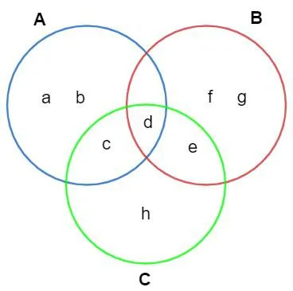
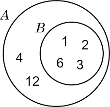
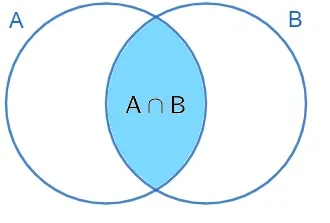

You’ll find this post in your `_posts` directory. Go ahead and edit it and re-build the site to see your changes. You can rebuild the site in many different ways, but the most common way is to run `jekyll serve`, which launches a web server and auto-regenerates your site when a file is updated.

Jekyll requires blog post files to be named according to the following format:

`YEAR-MONTH-DAY-title.MARKUP`

Where `YEAR` is a four-digit number, `MONTH` and `DAY` are both two-digit numbers, and `MARKUP` is the file extension representing the format used in the file. After that, include the necessary front matter. Take a look at the source for this post to get an idea about how it works.

Jekyll also offers powerful support for code snippets:


def print_hi(name)
  puts "Hi, #{name}"
end
print_hi('Tom')
#=> prints 'Hi, Tom' to STDOUT.


Check out the [Jekyll docs][jekyll-docs] for more info on how to get the most out of Jekyll. File all bugs/feature requests at [Jekyll’s GitHub repo][jekyll-gh]. If you have questions, you can ask them on [Jekyll Talk][jekyll-talk].

[jekyll-docs]: https://jekyllrb.com/docs/home
[jekyll-gh]:   https://github.com/jekyll/jekyll
[jekyll-talk]: https://talk.jekyllrb.com/

# Conjuntos e intervalos reais

### Definição:

Conjunto é o agrupamento de elementos que possuem uma característica em comum. Por exemplo o conjunto de números inteiros de 0 a 5 é:

> `{1, 2, 3, 4, 5}`
> - 
> - Todos os números representados acima tem em comum o fatos de serem inteiros e estarem no intervalo de 0 à 5. O número 1,1 não faz parte pois não é um número inteiro assim como 6 não faz parte do conjunto por estar fora do intervalo do conjunto.

### Representação de conjuntos

Os **conjuntos** são representados por letras **maiúsculas** e os **elementos** por letras **minúsculas**. Para listar os elementos de um conjunto usamos `{}` antes e depois dos elementos.

#### Representação das notas musicais

> `M={dó, ré, mi, fa, sol, la, si}`
> - 
> - *Esta é a representação por extensão dos elementos.*

> `M={x|x é nota musical}`
> - 
> - *Esta é a representação dos elementos por propriedade comum.*

Temos também outra forma de representar conjuntos que é o diagrama de Venn-Euler representado na imagem abaixo.

### Relações

Temos o relacionamento entre elemento e conjunto, este relacionamento de baseia no pertencimento.

#### Representação de relacionamento de pertencimento
> dó &isin; M
> - 
> - Lê-se: o elemento dó pertence ao conjunto M 

> ml &notin; M
> - 
> - Lê-se: o elemento ml não pertence ao conjunto M, pois ml é uma unidade de medida não um nota musical 

Há também o relacionamento entre os conjuntos, este relacionamento se baseia no conceito de **incluído** ou **não incluido**.

> B &subseteq; A
> - 
> - Lê-se: o conjunto B está contido no conjunto A, logo B é um subconjunto de A.

> F &nsubseteq; A
> - 
> - Lê-se: o conjunto F não está contido no conjunto A, logo o conjunto F não é um subconjunto de A.

### Operações entre conjuntos

#### Igualdade

A igualdade acontece quando dois conjuntos A e B, possuem os mesmo elementos reciprocamente, então neste caso todos elementos de A pertecem a B e todos os elementos de B pertecem a A.

> `A = {1, 2, 3}`
> - 
> `B = {2, 3, 1}`
> - 

 A relação de igualdade entre A e B pode ser representada em símbolos.

> A=B &#8660; (x)(x &isin; A => x &isin; B)
> - 

#### União

A união de dois ou mais conjuntos se dá pelo agrupamento de seus elementos em um outro conjunto.

> `A = {1, 3, 2, 7}  B = {4, 3, 8, 9}` 
> - 

Considerandos os conjuntos A e B acima a união fica da seguinte forma.

> `A` &#8899; `B = {1, 3, 2, 7, 4, 8, 9}`
> - 

Tabém pode ser representado da seguinte forma:

>  `A` &#8899; `B = {x|x ` &isin; `A ou x` &isin; `B }`
> - 

#### Intersecção

A intersecção de dois ou mais conjuntos será um novo conjunto com os elementos que existem em ambos os conjuntos. 

*O exemplo abaixo considera os conjuntos A e B anteriores.*

> `A` &#8898; `B = { 3 }`
> - 

Também pode ser representado assim:

> `A` &#8898; `B = {x|x ` &isin; `A e x` &isin; `B }`
> - 

A mesma representação em diagrama:

#### Diferença entre conjutos

